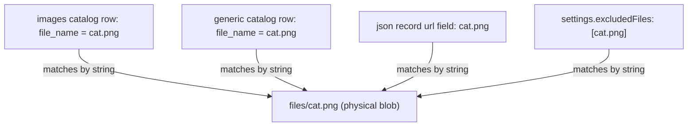
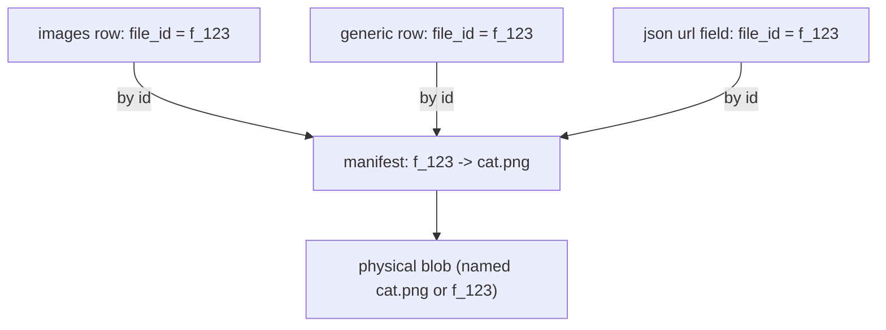

# Design note: stable file IDs vs. filename-as-identity

**Status:** Discussion / not committed. This document weighs the pros and cons of
giving every physical blob a **stable file ID** and referencing that ID across
the app, instead of using the **filename** (`file_name` basename) as the
cross-catalog identity.

**Companion docs:** [`FEATURES.md`](FEATURES.md) (current behavior + file map),
[`FUTURE_CHANGES.md`](FUTURE_CHANGES.md) (deferred work), [`../README.md`](../README.md)
(install + data layout).

---

## 1. How identity works today

All file-backed kinds (`images`, `generic`, `blob_store`) share one global
`files/` directory ([`getGlobalFilesDir()`](../src/lib/storage/paths.ts)). Per-type
folders hold only catalog JSON that references blobs **by `file_name`**.

- Each catalog record already has a local `id` (a UUID), but that id is
  **per-catalog**, not global. The same physical blob referenced by two catalogs
  has two unrelated record ids. See [`ImageRecordSchema`](../src/lib/core/types.ts)
  (`id`, `file_name`, ...).
- The **only** thing that ties a blob to its catalog rows across the workspace is
  the `file_name` string. In effect, **the filename is the global primary key.**
- Blob-store / unlinked list items don't even have a stored row; they get a
  synthetic id `unlinked:<encoded filename>` ([`toUnlinkedListItem`](../src/lib/storage/repo.ts)),
  so their identity is *literally* the filename.
- Filenames also appear **inside field values**: `url`-type and `file`-type
  fields can embed a filename, and `settings.excludedFiles` is a list of
  filenames.

### What that forces today

Because the filename is the key, any rename or delete must fan out across the
whole workspace:

- **Rename** ([`renameFileById`](../src/lib/storage/repo.ts)) renames the blob on
  disk, then loops over **every** media type to rewrite `file_name`, embedded
  `url`/array field values, and `excludedFiles` entries from the old name to the
  new name.
- **Delete from disk** ([`removeCatalogReferencesToFileGlobally`](../src/lib/storage/repo.ts))
  loops every catalog and strips rows matching the filename.

Every arrow above is a **string match on the filename**. Rename = rewrite all
arrows; miss one and you get a dangling reference (exactly the blob-store rename
bug: the `unlinked:` path renames the file but skips the fan-out).

---

## 2. The proposed change

Introduce a **stable, opaque file ID** (e.g. a UUID or content hash) as the
identity of each physical blob, recorded once in a **global file manifest**, and
have catalogs reference `file_id` instead of `file_name`.

Conceptually:

- New global manifest, e.g. `files/manifest.json` (or a sidecar), mapping
  `file_id -> { file_name, size, hash?, created_at }`. The manifest is the single
  place the filename lives.
- Catalog rows store `file_id` and resolve the display name via the manifest.
- Optionally store blobs on disk under their `file_id` (content-addressed) and
  treat `file_name` as pure display metadata; or keep human-readable names on
  disk and only use the manifest for the id↔name mapping.

Rename now means **update one manifest entry**; every reference is unchanged.

---

## 3. Pros

- **Rename becomes O(1) and atomic.** Update one manifest entry instead of
  rewriting `file_name` across every catalog, `url`/`file` field, and
  `excludedFiles` list. This directly removes the class of bug where one path
  (e.g. the blob-store `unlinked:` branch) forgets to fan out.
- **No more dangling references from string drift.** References can't silently
  break because they no longer depend on a mutable string being rewritten
  everywhere in lockstep.
- **Cleaner cross-catalog model.** "Same blob referenced by N catalogs" becomes a
  real relationship (shared `file_id`) instead of an emergent property of equal
  strings. Delete-from-disk impact ("referenced in these groups") is a manifest
  lookup, not a scan-and-match.
- **Enables real features:**
  - Duplicate detection / dedupe via content hash.
  - Safe display-name collisions (two blobs named `IMG_001.jpg` can coexist).
  - Per-file metadata in one place (size, hash, created time, tags).
- **Stronger invariants for tests.** Identity stops being a formatting/encoding
  concern (URL-encoding of `unlinked:` ids, case sensitivity, path separators).

---

## 4. Cons / costs

- **Migration is non-trivial and one-way-ish.** Every existing catalog row and
  every filename embedded in `url`/`file`/`excludedFiles` values must be rewritten
  to ids, and a manifest must be generated for all current blobs. This is exactly
  the kind of workspace-wide rewrite [`scripts/upgrade-data.mjs`](../scripts/upgrade-data.mjs)
  exists for, but it's a bigger, riskier pass than the existing upgrades.
- **Loss of human-readable, git-/filesystem-friendly data.** Today a catalog JSON
  is readable and a blob on disk is named `cat.png`. Content-addressed storage
  (blobs named by id) makes the `files/` directory opaque to humans and external
  tools. Keeping human names on disk avoids this but reintroduces a name the
  manifest must keep in sync.
- **A new single point of failure.** `manifest.json` becomes critical state. It
  needs the same atomic-write + file-lock discipline already used for catalogs
  ([`withFileLock`](../src/lib/storage/repo.ts)), plus a repair path for when the
  manifest and disk drift (file added/removed outside the app).
- **Pervasive code churn.** `file_name` is threaded through the repo, API routes,
  client helpers, and components (list items, `apiImageUrlByIdForType`, rename,
  upload, metadata, excluded). All of it would need an indirection through the
  manifest. The blob-store "flat listing" and `unlinked:` synthetic ids would be
  reworked or removed.
- **External edits get harder.** Dropping a file into `files/` by hand no longer
  "just works" — it has no manifest entry until the app reconciles it. Today an
  unmanaged file shows up immediately in the blob store.
- **Two ids to reason about.** Unless we also unify per-catalog record `id` with
  the new `file_id`, contributors must keep "record id" vs "file id" straight.

---

## 5. Incremental / hybrid options

This doesn't have to be all-or-nothing. Roughly increasing cost/benefit:

1. **Fix fan-out only (no new model).** Keep filename-as-identity but make every
   mutation path correct and shared (one propagation helper used by both the
   linked and `unlinked:` rename branches). Lowest cost; removes today's concrete
   bug but keeps O(N-catalogs) renames and the drift risk. (This is the separate
   bug-fix plan already drafted.)
2. **Additive manifest, filename still canonical.** Add `files/manifest.json` with
   `file_id -> file_name` for features (hash/dedupe/metadata) but keep references
   by filename for now. Buys observability and dedupe without the big rewrite.
3. **Reference by id, keep human names on disk.** Catalogs store `file_id`; blobs
   keep readable names; manifest maps id↔name. Rename = manifest-only update.
   Most of the benefit; avoids opaque storage; still a full migration of refs.
4. **Full content-addressed store.** Blobs stored under id; names are pure
   metadata. Maximum benefit (dedupe, immutability) and maximum churn/migration.

---

## 6. Recommendation (for discussion)

If the near-term pain is "rename doesn't stay consistent across the workspace,"
option **1** solves that today with minimal risk. If the goal is to make that
class of bug structurally impossible and unlock dedupe/metadata, option **3** is
the sweet spot: references become stable ids, rename is a one-line manifest
update, and the `files/` directory stays human-readable. Option **4** is only
worth it if content-addressed immutability/dedupe is itself a product goal.

Open questions to settle before committing to 3/4:
- ID scheme: random UUID (simple) vs. content hash (enables dedupe, but renames
  of identical content collapse)?
- Where does the manifest live, and how do we reconcile files added/removed
  outside the app (startup scan? lazy heal? explicit "rescan" action)?
- Do we unify `file_id` with the per-catalog record `id`, or keep them distinct?
