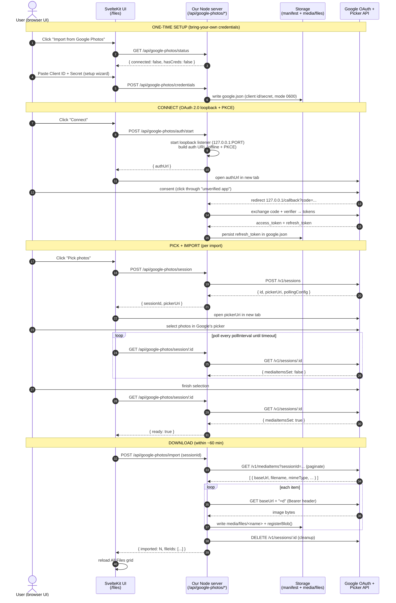

# Plan — Google Photos import (Picker API)

> **Status:** design / feasibility (not started). **Verdict: feasible.** Maps
> cleanly onto the existing upload → manifest path. The hard parts are all on
> Google's side (OAuth verification + the picker-only access model), not ours.
>
> **UI mockup:** [`docs/google-photos-import.html`](../google-photos-import.html)
> — 6-step interactive walkthrough (entry menu → setup → connect → Google picker
> → import → done). Backlog entry: **Item 37** in [`FUTURE_CHANGES.md`](../FUTURE_CHANGES.md).
>
> **Decisions locked (2026-06-22):**
> - **Credentials:** bring-your-own — each user supplies their own Google Cloud
>   OAuth client. No app-wide verification.
> - **Import target:** All Files (unclassified) — imported blobs are plain files,
>   classified later like any upload.
> - **Constraints:** documented prominently (see §0).

---

## 0. Constraints you are buying into (read first)

These come from Google's 2025 API changes and are **not** things we can engineer
around — they shape the whole UX:

1. **No library browsing or syncing.** The old Library API was removed
   2025-03-31. The **Picker API** is the only path. The user selects photos
   **inside Google's own hosted picker window**; our app only ever receives the
   items they hand-picked. There is no "import my whole library," no album
   listing, no background sync. Every import is a manual selection.
2. **The picker opens in a real browser tab.** `pickerUri` is **not**
   iframe-embeddable. We open it in a new tab/window and poll for completion.
3. **~60-minute download window.** Picked items expose a `baseUrl` that expires
   in ~1 hour and **requires the OAuth bearer header** to download. So we must
   download the bytes immediately after the user finishes picking — no deferring.
4. **7-day re-login in "Testing" mode.** Because each user runs their own
   unverified OAuth app (Testing publishing status), Google expires refresh
   tokens after **7 days**. Practically: the user re-connects ~weekly. (They can
   push their own Cloud project to "In production" to make tokens long-lived,
   but the "unverified app" warning screen persists either way.)
5. **First-run setup friction.** Bring-your-own-credentials means a one-time
   wizard: create a Cloud project, enable the Picker API, make a Desktop OAuth
   client, paste client ID + secret. Standard for self-hosted tools (rclone,
   Home Assistant, gphotos-sync) but it is real friction.

What we **get** in return: a free, official, supported API; full-resolution
downloads with EXIF intact (feeds the existing EXIF tooling); and a flow that
reuses our blob/manifest plumbing almost entirely.

---

## 1. Backend workflow (the API dance)



### Endpoints we call on Google

| Step | Method + URL | Notes |
|------|--------------|-------|
| Auth | `accounts.google.com/o/oauth2/v2/auth` | offline + PKCE, scope below |
| Token | `oauth2.googleapis.com/token` | code→tokens, and refresh |
| Create session | `POST photospicker.googleapis.com/v1/sessions` | returns `pickerUri`, `pollingConfig` |
| Poll | `GET .../v1/sessions/{id}` | wait for `mediaItemsSet: true` |
| List | `GET .../v1/mediaItems?sessionId={id}` | `pageSize≤100`, paginate |
| Download | `GET {baseUrl}=d` + `Authorization: Bearer` | ~60-min expiry, full-res + EXIF |
| Cleanup | `DELETE .../v1/sessions/{id}` | avoid `RESOURCE_EXHAUSTED` |

**Scope (the only one needed):**
`https://www.googleapis.com/auth/photospicker.mediaitems.readonly`

---

## 2. Where the code goes

### New files

```
src/lib/server/googlePhotos.ts        # OAuth2 client + Picker REST calls (session/poll/list/download)
src/lib/storage/googleConfig.ts       # read/write media/google.json (client id/secret + refresh token), 0600
src/lib/api/googlePhotos.ts           # client wrappers (status, connect, session, import)

src/routes/api/google-photos/
  status/+server.ts                   # GET  → { hasCreds, connected, expiresHint }
  credentials/+server.ts              # POST → save client id/secret
  auth/start/+server.ts               # POST → { authUrl }, spins loopback listener
  auth/callback/+server.ts            # GET  → catches ?code=, exchanges, stores refresh token
  session/+server.ts                  # POST → create picking session → { sessionId, pickerUri }
  session/[id]/+server.ts             # GET  → poll status → { ready }
  import/+server.ts                   # POST → list + download + registerBlob, returns fileIds

src/lib/components/google-photos/
  GooglePhotosDialog.svelte           # the modal: setup wizard → connect → pick → progress → done
```

### Existing files we touch

| File | Change |
|------|--------|
| `src/routes/files/+page.svelte` | Add a **"⋮ More" overflow `DropdownMenu`** next to the existing Upload button (~line 759) containing **"Import from Google Photos…"** (+ "Manage connections…") — kept out of the primary toolbar since it's a rare action. Mount `GooglePhotosDialog`; on success call existing `loadMeta()` + `loadFiles()`. Compose the existing shadcn `DropdownMenu` primitive (same one `EntityRowMenu` uses). |
| `src/lib/api/files.ts` | (optional) export the new wrappers, or keep them in `api/googlePhotos.ts`. |
| `package.json` | add `google-auth-library` (OAuth2 + PKCE + auto token refresh). Skip `googleapis` — there's no first-party Picker client, so we hit the REST endpoints directly via the auth client's `.request()`. |
| `docs/FEATURES.md` | new feature row + the 7 API endpoints (required by repo rules). |
| `.gitignore` / data hygiene | `media/google.json` holds a secret — never seed it into `test-fixtures/`. |

### The import primitive already exists

The whole download side collapses into calls we already have. For each picked item:

```ts
// inside src/routes/api/google-photos/import/+server.ts
const bytes = await downloadPickedItem(item, accessToken); // GET baseUrl=d + Bearer
const safe = assertSafeBasename(item.mediaFile.filename);  // existing guard
fs.writeFileSync(path.join(getGlobalFilesDir(), safe), bytes);
const fileId = await registerBlob(safe, bytes.length);     // existing — mints id + manifest entry
```

`registerBlob()` (`classRepo.ts`) → `mintFileId()` (`manifest.ts`) is exactly what
the upload endpoint already does. HEIC from Google would need the same
`heic-convert` step the upload route uses — worth factoring that into a shared
helper so `/upload` and `/import` don't duplicate it. Because the target is "All
Files (unclassified)," we **stop here** — no `addMembers()` call; `classes[]`
stays empty and the user classifies later like any upload.

### Where secrets live

New `media/google.json` (written `0600`, never committed, never in fixtures):

```jsonc
{
  "clientId": "xxxx.apps.googleusercontent.com",
  "clientSecret": "...",        // for a Desktop client this is not truly secret, but still 0600
  "refreshToken": "...",        // present once connected
  "tokenObtainedAt": "2026-06-22T..."  // to warn before the 7-day Testing-mode expiry
}
```

This mirrors the existing `media/settings.json` pattern (atomic JSON write via
`json.ts`, resolved through `paths.ts`). Client secret can alternatively be read
from a `GOOGLE_CLIENT_SECRET` env var for users who prefer not to put it on disk.

---

## 3. Effort estimate

| Chunk | Rough size |
|-------|-----------|
| OAuth loopback + token storage (`googlePhotos.ts`, `googleConfig.ts`, auth routes) | M |
| Session create/poll/list/download + cleanup | M |
| Import route wiring to `registerBlob` (+ shared HEIC helper) | S |
| `GooglePhotosDialog.svelte` (wizard → connect → pick → progress) | M–L |
| Files page button + reload glue | S |
| Docs (`FEATURES.md`) + tests for the import primitive | S |

No DB, no schema migration, no fixture change. The dialog is the largest single
piece because of the multi-state wizard. Everything server-side is additive.

---

## 4. Open risks / things to confirm at build time

- **CASA / scope tier.** Google's docs don't clearly state whether
  `photospicker.mediaitems.readonly` is *sensitive* (brand verification only) or
  *restricted* (annual CASA security audit). Bring-your-own-credentials sidesteps
  this for us, but confirm in the Cloud Console before assuming.
- **Loopback port.** Pick a free ephemeral port at `auth/start` time and pass it
  as the registered redirect; Desktop clients allow any `127.0.0.1` port.
- **Token refresh UX.** Surface "connected, expires in N days" from
  `tokenObtainedAt` so the weekly re-login isn't a surprise.
- **Partial import failures.** Download loop should be resilient per-item (one
  bad/expired baseUrl shouldn't abort the batch); report `{ imported, failed }`.
```
